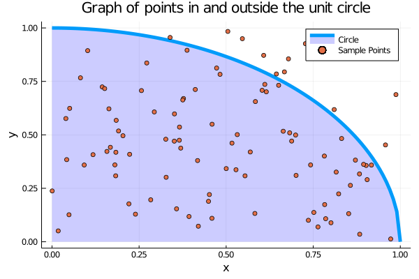

# ComputationalStochastics.jl
Examples of computational stochastic processes in Julia lang.
Examples translated from Python to Julia, Python notebooks available at [Urbain Vaes' Website](https://urbain.vaes.uk/teaching/2020-csp/) for the 2020 Imperial College London course in Computational Stochastic Processes, under an MIT Licence.

### Example 1 - Estimate pi

If we simulate numbers in the x-y plane uniformly on the interval between 0 and 1 (inclusive), we can check whether these points lie within the unit circle (x^2 + y^2 <= 1) or not. The ratio of points inside the unit circle to total number of points will approach the value pi / 4. This allows us to calculate a rough estimate for pi.

